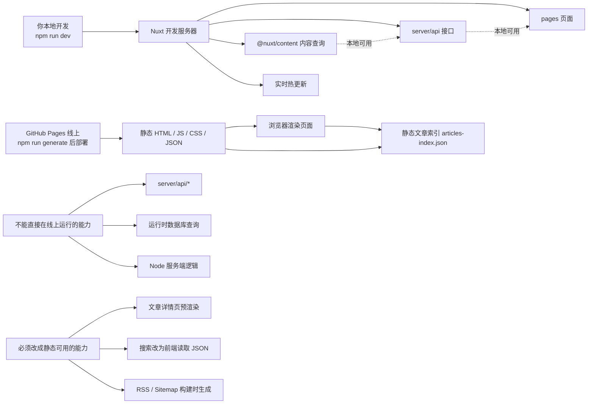

# StarSite 架构说明

## 本地开发 vs GitHub Pages 线上

## 一句话理解

- 本地 `npm run dev` 是带服务端能力的开发环境
- 线上 `npm run generate` 是提前生成好的静态站点

也就是说：

- 本地开发时，可以使用 `server/api/*`
- GitHub Pages 线上不能运行这些接口
- 所有线上必须依赖的能力，都要在构建阶段提前生成

## 对当前项目意味着什么

### 本地可用

- `server/api/articles`
- `server/api/articles/[...slug]`
- `server/api/search`
- `server/api/profile`
- `@nuxt/content` 查询能力

### GitHub Pages 线上可用

- 预渲染后的首页、列表页、详情页
- 中英文界面切换
- 静态文章索引搜索
- 图片和音频资源
- RSS 与 Sitemap

### GitHub Pages 线上不可直接运行

- 真正的运行时 API
- 动态数据库查询
- 登录鉴权
- 后台管理
- 服务端搜索

## 当前项目怎么兼容 GitHub Pages

### 1. 搜索

搜索已从运行时 API 改成静态方案：

- 构建阶段生成 `public/articles-index.json`
- 浏览器端读取 JSON 做标题、摘要、标签、分类模糊匹配

### 2. 文章详情页

文章详情页已显式加入静态预渲染路由，避免 GitHub Pages 上出现：

- 点击详情空白
- 刷新详情页 404

### 3. 内容源

内容仍然以 Markdown 为主，但页面层已经尽量避免和底层内容查询强耦合，方便后续继续升级。

## 当前建议

如果继续使用 GitHub Pages，新增功能时优先问自己一句：

这个能力是否必须依赖服务端实时运行？

如果答案是“必须”，那就有两种选择：

1. 改造成构建时静态生成
2. 未来切换到支持服务端运行的平台

## 未来如果要接后端

将来你如果要接：

- 评论
- 登录
- 内容管理后台
- 动态搜索
- 数据库存储

更适合迁移到：

- Vercel
- Netlify Functions
- Cloudflare
- 自己的 Node 服务

到那时，这个项目就可以逐步从“静态站”升级为“前后端协作站点”。
